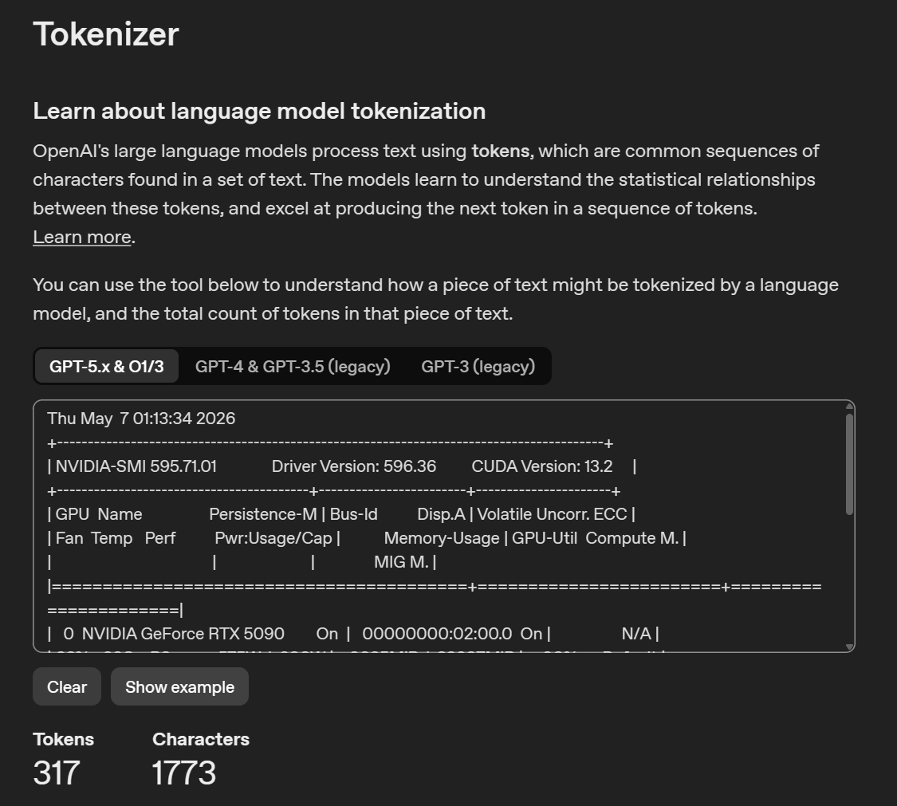
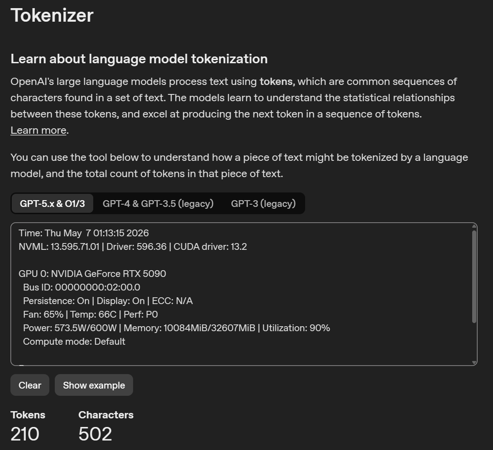
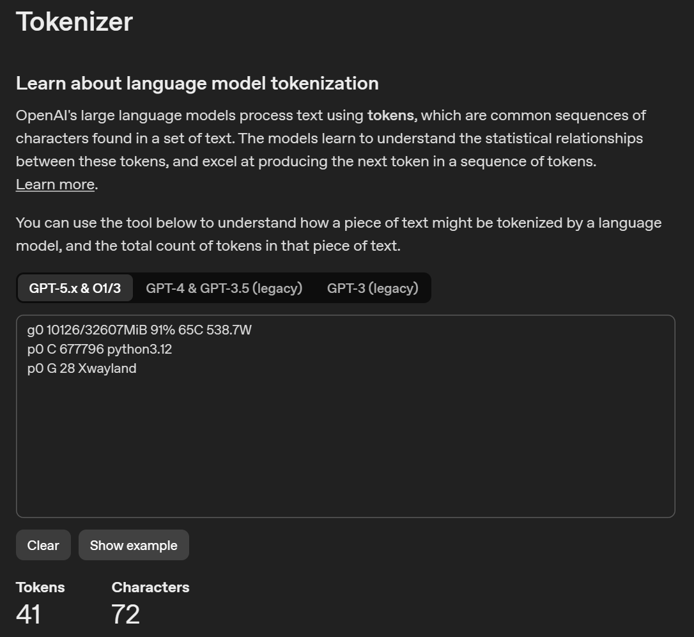

# nvclean

`nvclean` is a compact `nvidia-smi`-style CLI written in C. It queries NVIDIA GPUs through NVML directly and does not spawn or parse `nvidia-smi`.

The output is intentionally short: time, driver/NVML/CUDA driver versions, per-GPU status, and active compute/graphics processes.

## Agent-friendly output

`nvclean` and `nvmini` are designed for coding agents and terminal assistants that repeatedly inspect GPU state. Their compact, line-oriented output avoids the wide ASCII table produced by `nvidia-smi`, which can waste context tokens when copied into an LLM prompt.

In one GPT-5.x & O1/O3 tokenizer check on May 7, 2026:

| Tool | Tokens | Characters | Token reduction vs `nvidia-smi` | Character reduction vs `nvidia-smi` |
| --- | ---: | ---: | ---: | ---: |
| `nvidia-smi` | 317 | 1773 | baseline | baseline |
| `nvclean` | 210 | 502 | 34% | 72% |
| `nvmini` | 41 | 72 | 87% | 96% |

Screenshots from that tokenizer check:

<p>
  
  
  
</p>

For agent workflows, prefer:

```bash
nvclean
```

Fall back to `nvidia-smi` only when `nvclean` is unavailable or when you need fields outside this compact status view.

For even tighter polling output, use `nvmini`. It omits time, driver details, PCI/display/ECC/compute-mode fields, GPU names, and process memory. The fixed field order is:

```text
g<gpu> <used>/<total>MiB <util> <temp> <power>
p<gpu> <type> <pid> <process>
```

Example:

```text
g0 10084/32607MiB 90% 66C 573.5W
p0 C 645937 python3.12
p0 G 28 Xwayland
```

## Requirements

- NVIDIA GPU with a working NVIDIA driver
- NVML runtime library
- NVML header file
- C compiler and `make`

On WSL, the common paths are:

```bash
/usr/local/cuda/include/nvml.h
/usr/lib/wsl/lib/libnvidia-ml.so.1
```

If `nvml.h` is missing on WSL, install the CUDA Toolkit package, not the Linux display driver.

## Build

```bash
make
```

This builds both `nvclean` and `nvmini`.

For WSL, the default Makefile settings use:

```bash
NVML_INCLUDE=/usr/local/cuda/include
NVML_LIBDIR=/usr/lib/wsl/lib
```

For a regular Linux install where NVML is under `/usr/lib/x86_64-linux-gnu`, build with:

```bash
make NVML_LIBDIR=/usr/lib/x86_64-linux-gnu
```

If your system only has `libnvidia-ml.so.1` and not the linker symlink `libnvidia-ml.so`, build with the library path directly:

```bash
make LDLIBS=/usr/lib/wsl/lib/libnvidia-ml.so.1
```

## Install

```bash
make install
```

This installs to `~/.local/bin/nvclean` by default. Override `PREFIX` if needed:

```bash
make install PREFIX=/usr/local
```

`make install` installs both `nvclean` and `nvmini`.

## Codex skills

This repository includes two small Codex skills:

- `skills/nvclean/SKILL.md`: prefer `nvclean` over `nvidia-smi`
- `skills/nvmini/SKILL.md`: prefer `nvmini` for the shortest routine GPU checks

Prompt for an agent to install only `nvclean` and the `nvclean` skill:

```text
Install nvclean only. Use https://github.com/Rycen7822/nvclean. Clone or update it under /tmp/nvclean, build with make nvclean, install ./nvclean to ~/.local/bin/nvclean, ensure ~/.local/bin is on PATH for future shells, copy skills/nvclean/SKILL.md to ~/.codex/skills/nvclean/SKILL.md, then verify with command -v nvclean and nvclean. Do not install nvmini or the nvmini skill. On WSL, do not install Linux NVIDIA display drivers. If linking fails because libnvidia-ml.so is missing, retry with make nvclean LDLIBS=/usr/lib/wsl/lib/libnvidia-ml.so.1.
```

Prompt for an agent to install only `nvmini` and the `nvmini` skill:

```text
Install nvmini only. Use https://github.com/Rycen7822/nvclean. Clone or update it under /tmp/nvclean, build with make nvmini, install ./nvmini to ~/.local/bin/nvmini, ensure ~/.local/bin is on PATH for future shells, copy skills/nvmini/SKILL.md to ~/.codex/skills/nvmini/SKILL.md, then verify with command -v nvmini and nvmini. Do not install nvclean or the nvclean skill. On WSL, do not install Linux NVIDIA display drivers. If linking fails because libnvidia-ml.so is missing, retry with make nvmini LDLIBS=/usr/lib/wsl/lib/libnvidia-ml.so.1.
```

## Examples

`nvclean`:

```text
Time: Thu May  7 00:28:37 2026
NVML: 595.71.01 | Driver: 596.36 | CUDA driver: 13.2

GPU 0: NVIDIA GeForce RTX 5090
  Bus ID: 00000000:02:00.0
  Persistence: On | Display: On | ECC: N/A
  Fan: 37% | Temp: 47C | Perf: P0
  Power: 101W/600W | Memory: 6962MiB/32607MiB | Utilization: 7%
  Compute mode: Default

Processes:
  GPU 0 | PID 28 | Type G | /Xwayland | Memory N/A
  GPU 0 | PID 629519 | Type C | /python3.12 | Memory N/A
```

Process memory may be reported as `N/A` on WSL/Windows WDDM systems because that NVML field is not always available there.

`nvmini`:

```text
g0 10084/32607MiB 90% 66C 573.5W
p0 C 645937 python3.12
p0 G 28 Xwayland
```

## License

MIT
